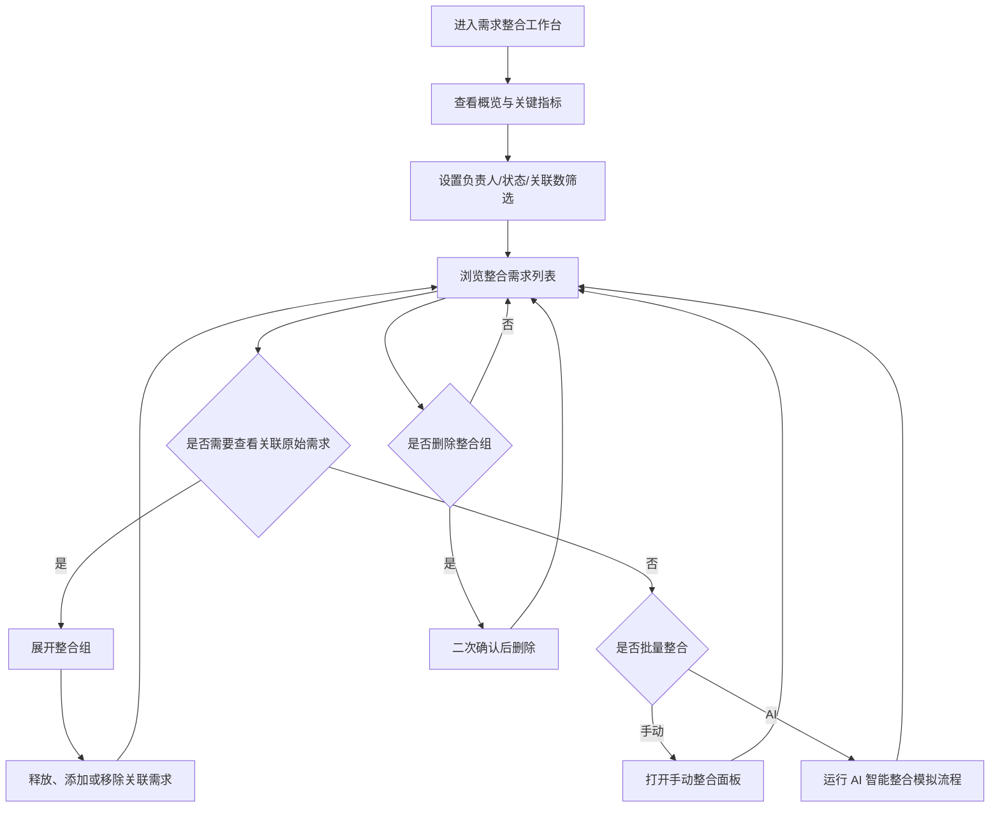

## 1. 产品概述
大促需求收集平台用于在大促筹备期统一管理、筛选、整合与跟进来自不同业务方的原始需求，降低重复提报和口径分裂带来的沟通成本。
- 目标用户为大促项目 PM、运营负责人、研发/测试协作人和需求评审成员。
- 核心价值是把分散需求沉淀为可跟进的整合需求组，并通过清晰状态、负责人、关联数和素材提示提升处理效率。

## 2. 核心功能

### 2.1 用户角色
| 角色 | 使用方式 | 核心权限 |
|------|----------|----------|
| 项目 PM | 工作台登录后进入默认栏目 | 查看概览、筛选需求、手动整合、AI 智能整合、删除整合组 |
| 需求负责人 | 工作台登录后进入我的需求 | 查看负责需求、添加原始需求、释放关联需求、移除本人负责关系 |
| 协作评审人 | 工作台登录后进入需求广场 | 浏览需求、查看状态、按负责人或状态筛选 |

### 2.2 功能模块
1. **顶部导航**：平台标识、需求广场、我的需求、需求整合、当前用户入口。
2. **左侧辅助栏**：概览数据、负责人/状态/关联数筛选、安全提示。
3. **需求整合工作台**：栏目标题、说明文案、返回、手动整合、AI 智能整合、关键指标卡片。
4. **整合需求列表**：关联数、整合需求标题、摘要、状态、负责人、素材标记和行级操作。
5. **关联原始需求展开区**：展示已关联原始需求、状态、负责人和释放操作。
6. **移动端适配视图**：顶部导航收敛、侧栏变筛选抽屉、表格行转换为信息卡片。
7. **操作反馈层**：二次确认、Toast 提示、AI 处理进度、空状态和无结果状态。

### 2.3 页面详情
| 页面名称 | 模块名称 | 功能描述 |
|----------|----------|----------|
| 需求整合页 | 顶部导航 | 高亮当前“需求整合”导航；点击其他导航展示提示或切换演示态。 |
| 需求整合页 | 概览卡片 | 展示整合组数、原始需求、跟进中、待处理等统计，随筛选结果联动更新。 |
| 需求整合页 | 筛选表单 | 支持按负责人、状态、关联数筛选；重置按钮恢复全部数据。 |
| 需求整合页 | 操作区 | 返回栏目列表展示提示；手动整合打开选择面板；AI 智能整合展示模拟处理进度与推荐结果提示。 |
| 需求整合页 | 指标卡片 | 展示最高关联、可展开组、跟进状态清晰度、待处理提示。 |
| 需求整合页 | 整合列表 | 默认展示 11 个整合组；支持展开/收起关联原始需求、添加需求、删除、移除负责人。 |
| 需求整合页 | 关联需求区 | 展示某整合组下的原始需求；释放后从当前组移除并更新关联数。 |
| 需求整合页 | 危险操作确认 | 删除整合组前弹出确认对话框，确认后删除并出现成功提示。 |
| 需求整合页 | 多端布局 | 桌面为左右工作台布局；平板隐藏侧栏并保留顶部操作；手机改为纵向卡片和底部筛选入口。 |

## 3. 核心流程
用户进入需求整合页后，先通过概览了解栏目整体处理情况，再使用筛选定位某负责人或待处理需求。用户可展开整合组查看关联原始需求，释放错误关联，或通过添加需求/手动整合补充关联项。对于重复需求较多的场景，可点击 AI 智能整合触发推荐提示；删除整合组必须经过二次确认。

## 4. 用户界面设计

### 4.1 设计风格
- **视觉方向**：延续设计稿的企业级蓝白工作台风格，强调信息清晰度、紧凑密度和状态可读性。
- **主色与状态色**：主色 `#2563eb`，浅色背景 `#f6f8fb`，卡片白色 `#ffffff`，成功 `#16a34a`，警告 `#d97706`，危险 `#dc2626`。
- **暗色主题**：保留设计稿暗色变量能力，支持一键切换浅色/暗色主题。
- **按钮样式**：中小圆角、细边框、紧凑高度，主按钮使用纯蓝底，次按钮使用白底蓝边，危险按钮使用柔和红色底。
- **字体与字号**：采用清晰的中文无衬线字体栈，标题 16-18px，正文 12-14px，数字使用等宽数字特性。
- **布局风格**：桌面端为顶部导航 + 左侧控制栏 + 右侧主表格；卡片圆角 8-16px，边框和浅灰背景分层。
- **图标风格**：使用 `lucide-react` 线性图标，图标尺寸 16px 为主，保持克制。
- **动效风格**：筛选、展开、Toast、确认弹窗使用 160-240ms 过渡，不引入夸张动效。

### 4.2 页面设计概览
| 页面名称 | 模块名称 | UI 元素 |
|----------|----------|---------|
| 需求整合页 | 顶部导航 | 56px 高度、白色卡片底、底部分割线、平台图标、导航高亮、用户头像按钮。 |
| 需求整合页 | 左侧概览 | 320px 宽度、两列统计卡、浅灰/蓝/橙状态底色、紧凑间距。 |
| 需求整合页 | 筛选区 | 垂直表单、下拉选择、重置按钮、焦点环和 hover 状态。 |
| 需求整合页 | 安全提示 | Shield 图标、红色柔和提示框、危险操作文案。 |
| 需求整合页 | 页面标题区 | 标题、说明文案、返回/手动整合/AI 智能整合按钮组。 |
| 需求整合页 | 指标区 | 四列指标卡片，移动端改为两列。 |
| 需求整合页 | 列表表头 | 灰底、紧凑行高、列宽与设计稿一致，桌面端固定列语义。 |
| 需求整合页 | 需求行 | 关联数大号数字、标题截断、摘要、状态标签、负责人胶囊、素材标签、行操作按钮。 |
| 需求整合页 | 展开区 | 嵌套卡片、关联原始需求列表、状态标签、释放按钮。 |
| 需求整合页 | 弹层反馈 | 居中确认框、右上 Toast、移动端底部筛选抽屉。 |

### 4.3 响应式设计
- **桌面端 ≥1280px**：完整展示 320px 左侧栏和表格列，表格列宽贴近设计稿。
- **平板端 768-1279px**：隐藏左侧栏，筛选入口移入顶部工具按钮；列表保持横向网格但压缩列间距。
- **手机端 <768px**：主列表转换为卡片，每张卡片垂直展示标题、状态、负责人、素材、操作；筛选使用底部抽屉；按钮允许换行。
- **触控优化**：移动端按钮高度不低于 40px，可点击区域增加内边距。
- **可访问性**：保留 `aria-label`、`aria-live`、键盘焦点环、语义化 `header/main/section/article`。

### 4.4 交互补充
- 筛选条件变更后实时过滤需求列表，并更新顶部统计。
- 点击“展开/收起”控制关联原始需求区域。
- 点击“释放”从当前整合组移除原始需求，并同步减少关联数。
- 点击“添加需求”打开轻量面板，可选择模拟原始需求并加入当前组。
- 点击“手动整合”打开多选整合面板，完成后显示成功提示。
- 点击“AI 智能整合”展示短暂 loading 和推荐整合完成提示。
- 点击“删除”必须弹出二次确认，确认后删除整合组，取消则保持不变。
- 空筛选结果展示无结果说明与重置按钮。
