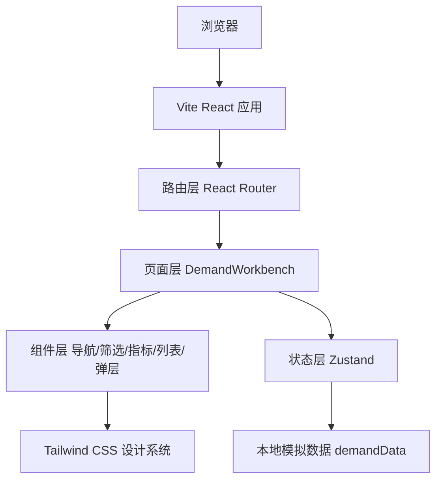

## 1. 架构设计
本项目为纯前端演示型工作台应用，使用本地模拟数据完成需求筛选、展开、整合、释放、删除与反馈交互，不依赖后端服务和数据库。



## 2. 技术说明
- **前端框架**：React 18 + TypeScript + Vite。
- **样式方案**：Tailwind CSS 3 + CSS Variables，复刻设计稿语义化颜色变量。
- **状态管理**：Zustand 管理筛选条件、需求组、展开行、弹层和 Toast。
- **路由方案**：React Router，默认路由 `/` 和 `/integration` 都展示需求整合工作台。
- **图标库**：`lucide-react`，用于平台标识、返回、整合、AI、提示等图标。
- **后端服务**：无；全部数据使用前端 mock，便于直接运行和演示。
- **数据库**：无；需求组和原始需求在 `src/data/demands.ts` 中初始化。
- **构建检查**：使用 TypeScript 编译与 Vite build 验证项目可运行性。

## 3. 路由定义
| 路由 | 用途 |
|------|------|
| `/` | 默认跳转或直接展示需求整合工作台。 |
| `/integration` | 需求整合页，承载设计稿主体页面和所有交互。 |
| `*` | 兜底展示需求整合页或轻量未找到提示。 |

## 4. 前端模块设计
| 目录/文件 | 职责 |
|-----------|------|
| `src/App.tsx` | 应用入口路由与页面挂载。 |
| `src/pages/DemandWorkbench.tsx` | 页面容器，组合导航、侧栏、指标、列表和弹层。 |
| `src/components/AppHeader.tsx` | 顶部导航和用户入口。 |
| `src/components/Sidebar.tsx` | 概览、筛选和安全提示。 |
| `src/components/MetricCards.tsx` | 页面关键指标展示。 |
| `src/components/DemandList.tsx` | 整合需求列表、移动端卡片布局和展开区。 |
| `src/components/ActionModals.tsx` | 删除确认、添加需求、手动整合和移动筛选抽屉。 |
| `src/components/Toast.tsx` | 操作反馈提示。 |
| `src/store/useDemandStore.ts` | Zustand 状态、派生统计和操作方法。 |
| `src/data/demands.ts` | 设计稿对应的整合需求与原始需求 mock 数据。 |
| `src/types/demand.ts` | 需求组、原始需求、筛选条件等类型定义。 |
| `src/index.css` | Tailwind 基础层、语义化变量、滚动条和响应式辅助样式。 |

## 5. 状态与数据模型

### 5.1 TypeScript 类型
```ts
type DemandStatus = '跟进中' | '待处理'

interface RawDemand {
  id: string
  title: string
  owner: string
  status: DemandStatus
  hasImage: boolean
}

interface DemandGroup {
  id: string
  title: string
  summary: string
  status: DemandStatus
  owner: string
  hasImage: boolean
  relationCount: number
  rawDemands: RawDemand[]
}

interface DemandFilters {
  owner: string
  status: string
  relationRange: string
}
```

### 5.2 主要状态
- `groups`：当前整合需求组列表。
- `filters`：负责人、状态、关联数筛选条件。
- `expandedIds`：已展开的整合组 ID 集合。
- `activeModal`：当前弹窗类型和目标需求组。
- `toast`：操作结果提示。
- `isAiRunning`：AI 智能整合模拟加载状态。
- `theme`：浅色/暗色主题。

### 5.3 主要操作
- `setFilter`：更新筛选条件。
- `resetFilters`：重置筛选。
- `toggleExpanded`：展开或收起整合组。
- `releaseRawDemand`：释放关联原始需求并更新关联数。
- `deleteGroup`：删除整合组。
- `addRawDemand`：向整合组添加模拟原始需求。
- `runAiMerge`：模拟 AI 智能整合流程并显示反馈。
- `toggleTheme`：切换浅色/暗色主题。

## 6. 样式实现策略
- 将设计稿中的 `--demand-*` 变量迁移到 `src/index.css`，浅色和暗色主题都保留。
- 使用 Tailwind utility class 复刻边框、圆角、间距、状态标签、表格列宽和按钮风格。
- 桌面端使用 `xl:grid-cols-[320px_minmax(0,1fr)]` 实现侧栏 + 主区布局。
- 需求列表桌面端使用 CSS Grid 固定列语义，移动端通过媒体查询切换为卡片。
- 使用 `font-variant-numeric: tabular-nums` 保证数字对齐。
- 使用自定义滚动条和 `min-h-0` 控制工作台内部滚动，保持顶部导航固定。

## 7. 交互与可访问性
- 所有按钮具备 `type="button"` 和清晰的可见 hover/focus 状态。
- 危险操作使用 `role="dialog"` 确认框，并提供取消与确认按钮。
- Toast 使用 `aria-live="polite"`，保证读屏可感知状态变化。
- 筛选表单使用 `label` 与 `select` 绑定。
- 移动端筛选抽屉使用遮罩和底部面板，点击关闭或重置均可恢复列表。
- 对无结果状态提供重置入口，避免用户陷入空白页面。

## 8. 测试与验证
- 运行 `npm run build` 验证 TypeScript 和 Vite 构建。
- 启动 `npm run dev` 后检查桌面、平板、手机断点布局。
- 手动验证筛选、重置、展开/收起、释放、添加需求、手动整合、AI 智能整合、删除确认、主题切换。
- 检查键盘 Tab 焦点、按钮 hover、Toast 和弹窗可见性。
